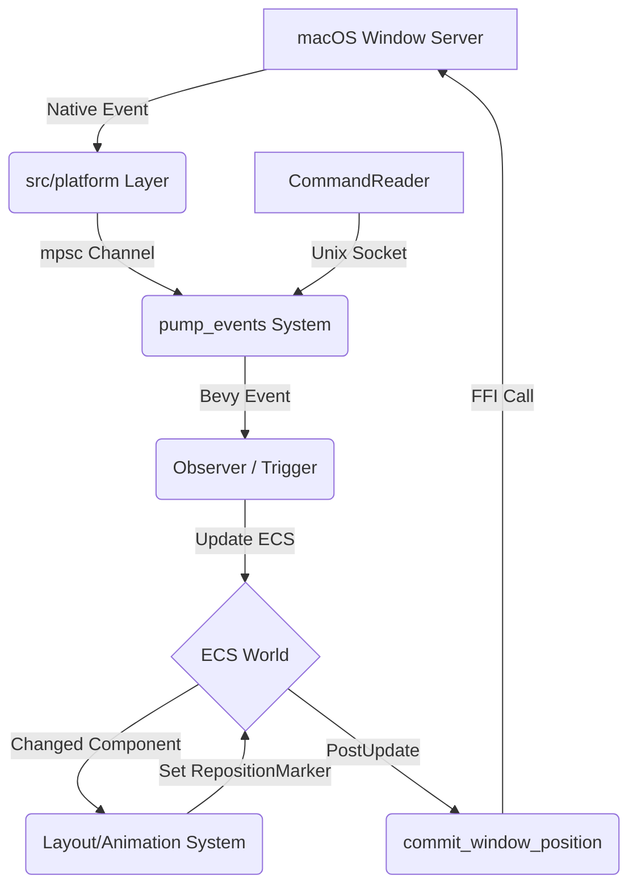

# Paneru Architecture

This document provides a high-level overview of Paneru's architecture for contributors. Paneru is a macOS window manager built using the **Bevy Game Engine** and its **Entity Component System (ECS)**.

## 1. High-Level Overview

Paneru manages macOS windows as a **sliding strip** (inspired by Niri and PaperWM). The core design philosophy is **Data-Driven/ECS**: instead of managing windows as complex objects with internal state, we represent the "World" as a collection of simple data components (Windows, Displays, Workspaces) that are processed by systems.

The primary problem Paneru solves is providing a predictable, stable, and ergonomic tiling experience on macOS. By using Bevy's ECS, we gain:
- **Declarative Logic:** Systems react to changes in window properties (e.g., `Changed<Position>`).
- **High Performance:** Parallel system execution and efficient change detection.
- **Modularity:** Functionality is divided into decoupled plugins and systems.

## 2. The Bevy Bridge

Bevy is typically used for games, so Paneru implements a custom bridge to interact with the macOS Window Server.

### Event Ingestion (macOS -> ECS)
1.  **Platform Layer:** `src/platform/` uses `objc2` and AppKit to interface with macOS. It runs a native event loop or hooks into OS notifications.
2.  **Event Channel:** macOS events (mouse moves, window creations, space changes) are sent via a thread-safe `mpsc` channel.
3.  **Pump System:** The `pump_events` system (in `src/ecs/systems.rs`) reads from this channel during the `PreUpdate` phase and writes Bevy `Message`s or triggers `Observer`s.
4.  **Observers:** Bevy Observers (in `src/ecs/triggers.rs`) react to these events to update the ECS World (e.g., spawning new `Window` entities or updating `FocusedMarker`).

### State Synchronization (ECS -> macOS)
1.  **Systems:** Bevy systems (like `layout::position_layout_windows`) calculate the intended positions and sizes of windows based on the tiling logic.
2.  **Commit Systems:** In the `PostUpdate` phase, specialized systems like `commit_window_position` and `commit_window_size` identify windows that need updating.
3.  **FFI Calls:** These systems call methods on the `Window` trait object (implemented by `WindowOS` in `src/manager/windows.rs`), which performs the actual accessibility API calls to move or resize the physical macOS window.

**Note:** All AppKit/Accessibility calls must happen on the **Main Thread**. Paneru ensures this by using `NonSend` resources and executing critical synchronization systems on the main thread.

## 3. Crate & Module Map

| Directory / Module | Responsibility Statement |
| :--- | :--- |
| `src/ecs/layout.rs` | Tiling algorithms, column management, and coordinate calculations. |
| `src/ecs/systems.rs` | Bevy systems for lifecycle management, event pumping, and state syncing. |
| `src/ecs/params.rs` | High-level Bevy `SystemParam` abstractions for querying the World. |
| `src/ecs/triggers.rs` | Reactive event handlers (Observers) for OS and internal events. |
| `src/ecs/workspace.rs` | Management of virtual workspaces, display changes, and window movement between spaces. |
| `src/ecs/scroll.rs` | Input handling for trackpad swipe gestures, inertia, and snapping. |
| `src/ecs/focus.rs` | Focus management logic, including focus-follows-mouse and mouse-follows-focus. |
| `src/ecs/state.rs` | Persistence of window layout and workspace state across restarts. |
| `src/manager/` | OS-agnostic traits (`WindowApi`, `ProcessApi`) and their macOS implementations (`WindowOS`). |
| `src/platform/` | Low-level macOS FFI, event loop integration, and workspace/input hooks. |
| `src/config/` | Configuration parsing, validation, and hot-reloading logic. |
| `src/commands.rs` | Implementation of CLI subcommands and Unix socket communication. |
| `src/overlay.rs` | Logic for drawing active window borders and inactive window dimming. |

## 4. Key Data Entities

### Components
- **`Window`:** A wrapper around a macOS window handle (AXUIElement).
- **`Display`:** Represents a physical monitor and its bounds.
- **`LayoutStrip`:** A component attached to a Workspace/Display that manages the ordered list of `Column`s.
- **`Scrolling`:** Active horizontal strip scroll state (velocity, position); `source` distinguishes touchpad gesture vs scroll wheel so `[swipe.gesture] direction` and `[swipe.scroll] direction` apply independently in `scrolling_integrator`.
- **`LayoutPosition` / `Position`:** The intended (layout) vs. actual (on-screen) coordinates.
- **`Bounds` / `WidthRatio`:** The size of the window and its relative width in the tiling strip.
- **`FocusedMarker`:** Identifies the currently focused window.
- **`ActiveWorkspaceMarker`**: Identifies the currently active workspace.
- **`SelectedVirtualMarker`**: Marks a virtual workspace that is currently selected by the user.
- **`NativeFullscreenMarker`**: Marks a window that is in macOS native fullscreen mode.
- **`Unmanaged`:** An enum identifying windows that are `Floating`, `Minimized`, or `Hidden`.
- **`RepositionMarker` / `ResizeMarker`**: Used to signal that a window needs to be moved or resized.
- **`PositionAnimation` / `ResizeAnimation`**: In-flight interpolation state (from/to, elapsed, duration) while servicing those markers; removed when the target is reached.

### Resources
- **`WindowManager`:** A wrapper for the global window management state and OS bridge.
- **`Config`:** The current user configuration.
- **`PaneruState`**: The persisted state of the window manager, used for recovery after restarts.
- **`MissionControlActive`:** A flag indicating if macOS Mission Control is visible (disabling tiling).
- **`FocusFollowsMouse`:** Tracks which window should gain focus based on mouse position.

## 5. Architectural Invariants

- **Main Thread Only:** Any interaction with `objc2`, `AppKit`, or `Accessibility` APIs **must** occur on the main thread.
- **ECS as Source of Truth:** Tiling logic must operate on ECS components (`WidthRatio`, `LayoutStrip`). The physical macOS window state should be a reflection of the ECS state, not the other way around.
- **Pure Layout:** Layout math (in `layout.rs`) should remain as pure as possible, operating on coordinates and ratios rather than directly calling OS APIs.
- **Reactive Power Saving:** Systems should use Bevy's reactive scheduling to avoid CPU usage when no windows are moving or events are occurring.

## 6. Data Flow Diagram

## 7. Testing Strategy

1.  **Pure Unit Tests:** Located in `src/tests.rs` and alongside modules. These test layout math and configuration parsing without requiring a macOS environment.
2.  **ECS Integration Tests:** Use Bevy's `App` or `World` to drive systems in isolation. macOS APIs are typically mocked via the `WindowApi` and `WindowManagerApi` traits.
3.  **FFI Verification:** Manual or semi-automated tests on macOS to ensure the Accessibility API calls behave as expected with native windows.
4.  **Agent Support:** The `AGENTS.md` file provides project-specific guidance for AI agents to ensure contributions follow these architectural patterns.
